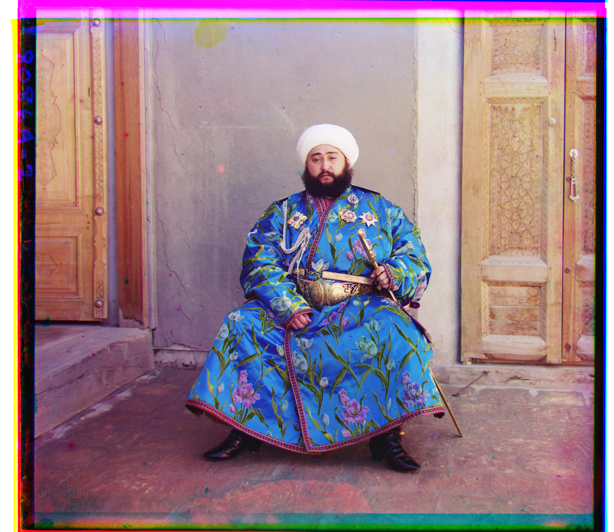

# Colorizing the Prokudin-Gorskii Photo Collection

CS 180 Project 1. Sergei Prokudin-Gorskii photographed the Russian Empire
from 1907 by taking three exposures of each scene through blue, green, and
red filters onto a single tall glass plate. This reconstructs the color
photographs: split each digitized plate into its three channels, align them,
and stack them into RGB.

**[→ Read the writeup](writeup.html)** — every image, its computed
displacements, and the failure analysis. (Open the file locally; GitHub
won't render HTML in-page.)



## Quick start

```bash
python -m venv .venv
.venv/Scripts/activate          # Windows;  source .venv/bin/activate on Unix
pip install -r requirements.txt

python make_test_plate.py       # synthetic plates with known offsets
python test_align.py            # regression suite -- should print "all checks passed"

python align.py data/cathedral.jpg --single
python align.py data/emir.jpg --pyramid --metric edge
```

The repo ships the 14 low-resolution plates. The full-resolution masters are
~70 MB each and are **not** committed; `python fetch_loc.py` downloads them
from the Library of Congress. Then:

```bash
python run_all.py               # every alignment -> results/summary.json
python make_writeup.py          # rebuilds writeup.html
```

## How it works

Displacements are reported as `(x, y)` = (column shift, row shift), applied
to G and R to bring them onto B.

**Single-scale** — exhaustive search over every integer displacement in a
`[-15, 15]²` window. Two metrics, both written from scratch: **SSD**
(`sqrt(Σ(a-b)²)`, minimized) and **NCC** (dot product of mean-subtracted,
norm-divided images, maximized). Scores use interior pixels only, since
plate borders carry scan artifacts that would otherwise dominate. Candidate
shifts are evaluated by slicing rather than rolling, so wrap-around pixels
are never compared.

**Pyramid** — the hi-res plates are ~3700×3200 per channel with true offsets
past 100 px, so an exhaustive window can neither reach the answer nor finish
in reasonable time. `align_pyramid` recursively halves the image until the
long side is ≤400 px, runs the full search there, then walks back up
refining by ±2 at each level. On `melons.tif` this is the difference between
a correct result in 4.8 s and a grossly mis-registered one in 119.7 s.

**The `edge` metric** — SSD and NCC both assume the three exposures agree on
*brightness*. Three plates break that assumption, and they don't break it
together: NCC collapses on `emir` (the Emir's robe is bright in blue, nearly
black in red), while SSD collapses on `church` and `railroad` (large flat
regions whose raw levels differ). Matching **gradient magnitude** instead of
intensity fixes all three, because an edge stays in the same place however
the exposure renders it. It's an additional option, not a replacement — the
required SSD and NCC results are reported unmodified, failures included.

All alignment logic is hand-written numpy. No `skimage.registration`,
`cv2.matchTemplate`, phase correlation, or built-in pyramid utility.

## Files

| | |
|---|---|
| `align.py` | the algorithm + CLI |
| `run_all.py` | runs every alignment, writes `results/summary.json` |
| `make_writeup.py` | builds `writeup.html` |
| `make_test_plate.py` | synthetic plates with known ground-truth offsets |
| `test_align.py` | regression suite |
| `fetch_loc.py` | resolves + downloads hi-res masters from LoC |
| `find_plate.py` | identifies a plate by image matching when its title can't be searched |
| `check_matcher.py` | validates `find_plate` against scenes with known answers |
| `status.py` | prints recorded runs |

## Data provenance

The course's official `data.zip` is on Google Drive behind a sign-in wall
that can't be scripted. The 14 low-resolution plates here come from the
course's fa25 gallery; the full-resolution masters come from the
[Library of Congress](https://www.loc.gov/collections/prokudin-gorskii/)
(public domain), which is where the course TIFFs originate. `fetch_loc.py`
verifies every candidate by cross-correlating it against the matching
low-res plate, accepting only near-perfect matches — this caught one wrong
match before it reached the results.

Hi-res coverage is 9 of the 11 dataset scenes plus 2 extra scenes pulled
from the collection. `icon` and `church` are aligned at low resolution only;
Russian and nothing there is titled "icon" or "church".

Dropping the real `data.zip` contents into `data/` and re-running
`run_all.py` reproduces everything against the exact course files.
